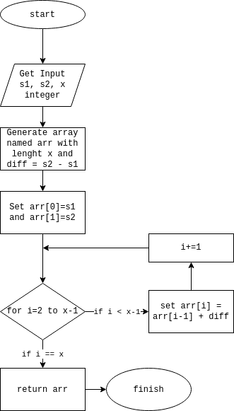

## Nomor 1

### Cara menjalankan server
Perhatikan bahwa database yang dganakan adalah MySQL. 

Sebelum menjalankan server kita perlu setup environement mulai dari database, jwt, port dengan membuat file pada forlder __no1__ dengan nama __.env__ dengan skema yang mirip pada file __no1/env.example__.

Untuk menjalankan server dapat di run command berikut:
```
go run no1/main.go
```

### Postman Documentation
Dokumentasi postman ada di folder __no1/documentation__.

### Tugas yang selesai
Tanda ✔ bererti sudah selesai:

A. Membuat fungsi login (5 point) ✔

B. Untuk authorization pada point A gunakan JWT (6 point) ✔

C. Laporan nama merchant, omzet per hari dalam pada bulan november mulai tanggal 1
sampai dengan tanggal 30 dengan pagination. Apabila tidak ada transaksi pada tanggal itu
omzet akan bernilai 0 (6 point) ✔

D. API untuk menampilkan laporan nama merchant, nama outlet, omzet per hari pada bulan
november mulai tanggal 1 sampai dengan tanggal 30 dengan pagination. Apabila tidak ada
transaksi pada tanggal itu omzet akan bernilai 0 (6 point) ✔

E. Pada poin C pastikan user tidak bisa melakukan akses pada merchant_id yang bukan
miliknya (10 point) ✔

F. Pada poin D pastikan user tidak bisa melakukan akses laporan pada outlet_id yang bukan
miliknya (5 point) ✔

G. Dari test case pada point C dan point D, apakah struktur ERD yang dibentuk sudah optimal
? berikan penjelasannya (9 point) ✔
- Untuk menjawab pertanyaan di atas menurut saya harus melihat PRD secara utuh. jik ahanya dari soal saja menurut saya pernu dibuat suatu table yang berisi tanggal sehingga bisa mudah untuk query disetiap tanggalnya.

H. Dokumen teknis Data Manipulation. ✔
- Dokumen ada pada folder __no1/documentation__.

## Nomor 2
### Kode Awal (Dari Soal)
#### Model
```go
type (
	Area struct {
		ID        int64  `gorm:"column:id;primaryKey"`
		AreaValue int64  `gorm:"column:area_value"`
		AreaType  string `gorm:"column:type"`
	}
)
```
Nilai AreaValue pada dasarnya dapat bernilai bilangan yang tidak bulat. Sehingga harusnya AreaValue bertipe *__float64__*. Namun danggap di database sudah bertipe *__int64__* maka kita tidak dapat udah kode tersebut.

#### Repository
```go
1.  func (_r *AreaRepository) InsertArea(param1 int32, param2 int64, type []string, ar *Model.Area) (err error) {
2.  	inst := _r.DB.Model(ar)
3.  	Var area int
4.  	area = 0
5.  	switch type {
6.  	case "persegi panjang":
7.  		var area := param1 * param2
8.  		ar.AreaValue = area
9.  		ar.AreaType = "persegi panjang"
10. 		err = _r.DB.Create(&ar).Error
11. 		if err != nil {
12. 			return err
13. 		}
14. 	case "persegi":
15. 		var area = param1 * param2
16. 		ar.AreaValue = area
17. 		ar.AreaType = "persegi"
18. 		err = _r.DB.Create(&ar).Error
19. 		if err != nil {
20. 			return err
21. 		}
22. 	case "segitiga":
23. 		var area = 0.5 * param1 * param2
24. 		ar.AreaValue = area
25. 		ar.AreaType = "segitiga"
26. 		err = _r.DB.Create(&ar).Error
27. 		if err != nil {
28. 			return err
29. 		}
30. 	default:
31. 		ar.AreaValue = 0
32. 		ar.AreaType = "undefined data"
33. 		err = _r.DB.Create(&ar).Error
34. 		if err != nil {
35. 			return err
36. 		}
37. 	}
38. }
```

Terdapat banyak kesalahan pada code diatas. Akan dibahas satu-persatu dari line paling atas.
```go
1.  func (_r *AreaRepository) InsertArea(param1 int32, param2 int64, type []string, ar *Model.Area) (err error) {
```
Pada baris diatas __param1__ harusnya bertipe *__int64__* karena __Area.AreaValue__ bertipe *__int64__*.

Kata __type__ harusnya diganti dengan kata lain misalkan __areaType__ karena kata __type__ digunakan untuk membuat blueprint. Tipe parameter tersebut seharusnya bernilai *__string__* karena __Area.AreaValue__ bertipe *__string__*.
```go
2.  	inst := _r.DB.Model(ar)
3.  	Var area int
4.  	area = 0
```

Pada baris ke-2 varibel __inst__ tidak pernah dipakai. Jadi baris ke-2 harusnya dihapus saja. 

Kemudian di baris selanjutnya, kata __Var__ harusnya diganti dengan __var__ dan langsung diinisialisasi nilainya. Namun secara umum area ini tidak terpakai karena kita dapat langsung masukkan ke dalam __ar.AreaType__. Sehingga baris ke-3 dan ke-4 dapat dihapus saja dan dianti dengan code berikut ```ar.AreaType = areaType``` (baris ke-32).

```go
5.  	switch type {
6.  	case "persegi panjang":
7.  		var area := param1 * param2
8.  		ar.AreaValue = area
9.  		ar.AreaType = "persegi panjang"
10. 		err = _r.DB.Create(&ar).Error
11. 		if err != nil {
12. 			return err
13. 		}
```
Pada baris ke-5 kata __type__ harusnya diganti dengan kata __ar.AreaType__. 

Baris ke-7 dapat dihapus saja, karena nilai area bisa langsung dimasukkan dalam __ar.AreaValue__. 

Baris ke-9 harusnya dihapus saja, karena nilainya akan dimasukkan di awal sebelum switch case. 

Kemudian code pada baris ke-10 sampai baris ke-12 harusnya diletakkan di luar switch case saja, karena code tersebut selalu dijalankan di setiap casenya. 

Untuk baris block *__case__* selanjutnya dapat mengkuti perbaikan yang sama dengan baris ke-7 sampai baris ke-13. Kecuali pada case __default__ code ```ar.AreaType = "undefined data"``` dipertahankan.

Untuk case "segitiga" nilai area di hitung dengan cara berikut:
```go
0.5 * param1 * param2
```
Ini akan error karena nilai __ar.AreaValue__ bertipe *__int32__* sehingga. Pada dasrnya nilai dari area (luas area) nilainya tidak selalu bulat. Namun karena dari blueprintnya sudah seperti itu kita dapat ubah menjadi:
```go
param1 * param2 / 2
```

Terakhir, sebelum baris terakhir tambahkan nilai default return fungsi tersebut. Tambhakan dengan ```return nil``` atau ```return err```.

#### Implementasi
```go
1.  err = _u.repository.InsertArea(10, 10, "persegi")
2. 	if err != nil {
3. 		log.Error().Msg(err.Error())
4. 		err = errors.New(en.ERROR_DATABASE)
5. 		return err
6. 	}
```
Pada baris pertama kita harus menambahkan input dengan tipe __Model.Area__.

### Kode Hasil Modifikasi (Contoh Konkrit)
Dari berbagai penjelasan diatas kita dapat modifikasi menjadi seperti berikut:

#### Repository
```go
1.  func (_r *AreaRepository) InsertArea(param1 int64, param2 int64, areaType string, ar *Model.Area) (err error) {
2.  	ar.AreaType = areaType
3.  	switch ar.AreaType {
4.  	case "persegi panjang":
5.  		ar.AreaValue = param1 * param2
6.  	case "persegi":
7.  		ar.AreaValue = param1 * param2
8.  	case "segitiga":
9.  		ar.AreaValue = param1 * param2 / 2
10. 	default:
11. 		ar.AreaValue = 0
12. 		ar.AreaType = "undefined data"
13. 	}
14. 	err = _r.DB.Create(&ar).Error
15. 	if err != nil {
16. 		return err
17. 	}
18. 	return nil
19. }
```
#### Implementasi
```go
1. 	ar := &model.Area{}
2. 	err = _u.repository.InsertArea(10, 10, "persegi", ar)
3. 	if err != nil {
4. 		log.Error().Msg(err.Error())
5. 		err = errors.New(en.ERROR_DATABASE)
6. 		return err
7. 	}
```

## Nomor 3
Flowchart:



Pseudocode untuk mendapatkan barisan:
```go
func series(a int, b int, x int) []int {
	res := make([]int, x)
	res[0] = a
	res[1] = b
	diff := b - a
	for i := 2; i < x; i++ {
		res[i] = res[i-1] + diff
	}
	return res
}
```

## Nomor 4
Pseudocode untuk megurutkan angka:
```go
func sort(input []float64, arg string) []float64 {
	n := len(input)
	for i := 0; i < n; i++ {
		for j := i + 1; j < n; j++ {
			switch arg {
			case "desc", "descending":
				if input[i] < input[j] {
					input[i], input[j] = input[j], input[i]
				}
			default:
				if input[i] > input[j] {
					input[i], input[j] = input[j], input[i]
				}
			}
		}
	}
	return input
}
```