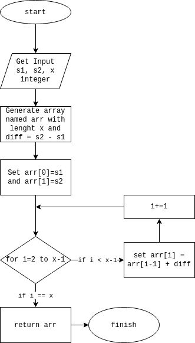

## Nomor 3
Flowchart:



Pseudocode untuk mendapatkan barisan:
```go
func series(a int, b int, x int) []int {
	res := make([]int, x)
	res[0] = a
	res[1] = b
	diff := b - a
	for i := 2; i < x; i++ {
		res[i] = res[i-1] + diff
	}
	return res
}
```
